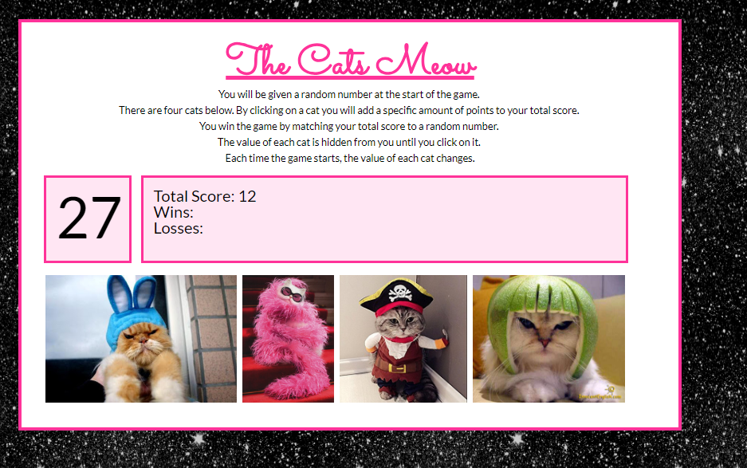

## The Cats Meow
This application is an interactive game that dynamically updates the HTML pages with jQuery.  In this game, the user needs to match the target number by clicking on cat picures.  The value of each cat is hidden until clicked.  

## Getting Started
Play here: https://alyciamriley.github.io/the-cats-meow/

## Technologies Used
- jQuery
- Google Fonts

## Screenshots

## Built With

- Brackets- Text Editor
- Bootstrap- Wireframe

## Future Development

-  mySQL database to track high scores
- Convert to a full React app using the MERN stack
- Add mobile responsiveness to users can play on their phones.

## Authors

* Alycia Riley
* [www.code-retro.com](http://www.code-retro.com)

